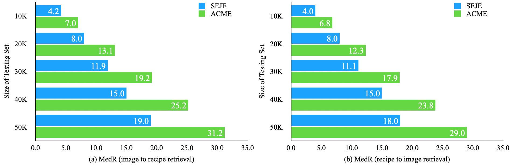

SEJE is a prototype for the paper
_Learning Text-Image Joint Embedding for Efficient Cross-Modal Retrieval with Deep Feature Engineering_.

## Contents
1. [Instroduction](#introduction)
1. [Installation](#installation)
2. [Recipe1M Dataset](#recipe1m-dataset)
3. [Vision models](#vision-models)
4. [Out-of-the-box training](#out-of-the-box-training)
5. [Training](#training)
6. [Testing](#testing)
7. [Contact](#contact)

## Introduction
**Overview:** SEJE is a two-phase deep feature engineering framework for efficient learning of semantics enhanced joint embedding, which clearly separates the deep feature engineering in data preprocessing from training the text-image joint embedding model. We use the Recipe1M dataset for the technical description and empirical validation. In preprocessing, we perform deep feature engineering by combining deep feature engineering with semantic context features derived from raw text-image input data. We leverage LSTM to identify key terms, deep NLP models from the BERT family, TextRank, or TF-IDF to produce ranking scores for key terms before generating the vector representation for each key term by using word2vec. We leverage wideResNet50 and word2vec to extract and encode the image category semantics of food images to help semantic alignment of the learned recipe and image embeddings in the joint latent space. In joint embedding learning, we perform deep feature engineering by optimizing the batch-hard triplet loss function with soft-margin and double negative sampling, taking into account also the category-based alignment loss and discriminator-based alignment loss. Extensive experiments demonstrate that our SEJE approach with deep feature engineering significantly outperforms the state-of-the-art approaches. 

### SEJE Architecture
<p align="center">
    
</p>

### SEJE Phase I Architecture and Examples
<p align="center">
    
</p>

<p align="center">
    
</p>

<p align="center">
    
</p>

### SEJE Phase II Architecture
<p align="center">
    
</p>

### SEJE Joint Embedding Optimization with instance-class double hard sampling strategy
<p align="center">
    
</p>

### SEJE Joint Embedding Optimization with discriminator based alignment loss regularization
<p align="center">
    
</p>

### SEJE Experimental Evaluation Highlights
<p align="center">
    
</p>
<p align="center">
    
</p>
<p align="center">
    
</p>

## Installation
We use the environment with Python 3.7.6 and Pytorch 1.4.0. Run ```pip install --upgrade cython``` and then install the dependencies with ```pip install -r requirements.txt```. Our work is an extension of [im2recipe](https://github.com/torralba-lab/im2recipe-Pytorch).

## Recipe1M Dataset
The Recipe1M dataset is available for download [here](http://im2recipe.csail.mit.edu/dataset/download), where you can find some code used to construct the dataset and get the structured recipe text, food images, pre-trained instruction featuers and so on. 

## Vision models
This current version of the code uses a pre-trained ResNet-50.

## Out-of-the-box training
To train the model, you will need to create following files:
* `data/train_lmdb`: LMDB (training) containing skip-instructions vectors, ingredient ids and categories.
* `data/train_keys`: pickle (training) file containing skip-instructions vectors, ingredient ids and categories.
* `data/val_lmdb`: LMDB (validation) containing skip-instructions vectors, ingredient ids and categories.
* `data/val_keys`: pickle (validation) file containing skip-instructions vectors, ingredient ids and categories.
* `data/test_lmdb`: LMDB (testing) containing skip-instructions vectors, ingredient ids and categories.
* `data/test_keys`: pickle (testing) file containing skip-instructions vectors, ingredient ids and categories.
* `data/text/vocab.txt`: file containing all the vocabulary found within the recipes.

Recipe1M LMDBs and pickle files can be found in train.tar, val.tar and test.tar. [here](http://im2recipe.csail.mit.edu/dataset/download)

It is worth mentioning that the code is expecting images to be located in a four-level folder structure, e.g. image named `0fa8309c13.jpg` can be found in `./data/images/0/f/a/8/0fa8309c13.jpg`. Each one of the Tar files contains the first folder level, 16 in total. 

The pre-trained TFIDF vectors for each recipe, image category feature for each image and the optimized category label for each image-recipe pair can be found in [id2tfidf_vec.pkl](https://drive.google.com/file/d/1TF6iuUDHqfqIT-LT5WQ-zX98mNyTzuOS/view?usp=sharing), [id2img_101_cls_vec.pkl](https://drive.google.com/file/d/1RGkl7ghjoX25hhgq2837Ou5iQWboiPbi/view?usp=sharing) and [id2class_1005.pkl](https://drive.google.com/file/d/1J75v63kgMTNGl9UKldq9kGQhSMRom1NX/view?usp=sharing) respectively.

### Word2Vec
Training word2vec with recipe data:

- Download and compile [word2vec](https://storage.googleapis.com/google-code-archive-source/v2/code.google.com/word2vec/source-archive.zip)
- Train with:

```
./word2vec -hs 1 -negative 0 -window 10 -cbow 0 -iter 10 -size 300 -binary 1 -min-count 10 -threads 20 -train tokenized_text.txt -output vocab.bin
```
The pre-trained word2vec model can be found in [vocab.bin](https://drive.google.com/file/d/1Qu2tiLPlCu9KaR2vhAc4T2dZlvPrKXAn/view?usp=sharing).


## Training
- Train the model with: 
```
CUDA_VISIBLE_DEVICES=0 python train.py 
```
We did the experiments with batch size 100, which takes about 11 GB memory.


## Testing
- Test the trained model with
```
CUDA_VISIBLE_DEVICES=0 python test.py
```
- The results will be saved in ```results```, which include the MedR result and recall scores for the recipe-to-image retrieval and image-to-recipe retrieval.
- Our best model trained with Recipe1M (TSC paper) can be downloaded [here](https://drive.google.com/drive/folders/1q4MpqSXr_ZCy2QiBn1XV-B6fFlQFjwSV?usp=sharing).


## Contact
We are continuing the development and there is ongoing work in our lab regarding cross-modal retrieval between cooking recipes and food images. For any questions or suggestions you can use the issues section or reach us at zhongweixie@gatech.edu.


Lead Developer: Zhongwei Xie, Georgia Institute of Technology

Advisor: Prof. Dr. Ling Liu, Georgia Institute of Technology


If you use our code, please cite

[1] Zhongwei Xie, Ling Liu, Yanzhao Wu, et al. Learning Text-Image Joint Embedding for Efficient Cross-Modal Retrieval with Deep Feature Engineering[J]//ACM Transactions on Information Systems (TOIS).

[2] Zhongwei Xie, Ling Liu, Lin Li, et al. Efficient Deep Feature Calibration for Cross-Modal Joint Embedding Learning[C]//Proceedings of the 2021 International Conference on Multimodal Interaction. 2021: 43-51.


